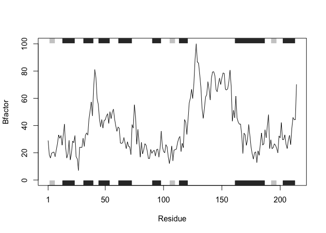
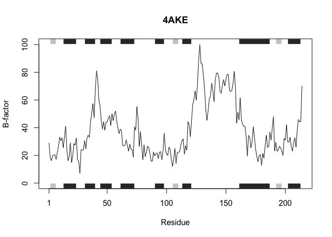
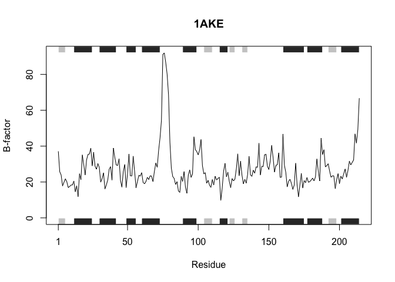
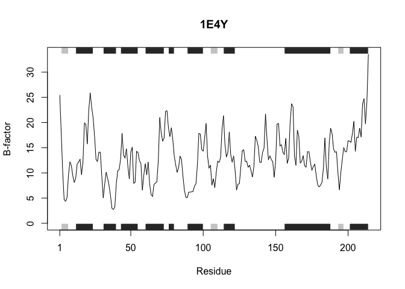
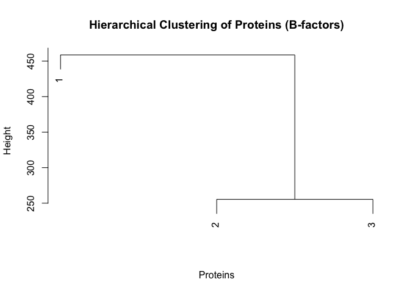

# Class 6 Function HW
Kiana Bohanon (PID: A17802316)

- [Introduction](#introduction)
- [My Function](#my-function)
- [Example](#example)

## Introduction

For this homework, we were asked to demonstrate a generalized approach
to analyze protein B-factors and perform hierarchical clustering on any
set of protein structures. We started with this code:

``` r
# Can you improve this analysis code?
library(bio3d)
s1 <- read.pdb("4AKE") # kinase with drug
```

      Note: Accessing on-line PDB file

``` r
s2 <- read.pdb("1AKE") # kinase no drug
```

      Note: Accessing on-line PDB file
       PDB has ALT records, taking A only, rm.alt=TRUE

``` r
s3 <- read.pdb("1E4Y") # kinase with drug
```

      Note: Accessing on-line PDB file

``` r
s1.chainA <- trim.pdb(s1, chain="A", elety="CA")
s2.chainA <- trim.pdb(s2, chain="A", elety="CA")
s3.chainA <- trim.pdb(s1, chain="A", elety="CA")
s1.b <- s1.chainA$atom$b
s2.b <- s2.chainA$atom$b
s3.b <- s3.chainA$atom$b
plotb3(s1.b, sse=s1.chainA, typ="l", ylab="Bfactor")
```



``` r
plotb3(s2.b, sse=s2.chainA, typ="l", ylab="Bfactor")
```


``` r
plotb3(s3.b, sse=s3.chainA, typ="l", ylab="Bfactor")
```


## My Function

``` r
# analyze_proteins
# This function will read in any set of protein PDB structures, 
# and extracts chain A alpha-carbon B-factors.
# It performs hierarchical clustering, and plots the results.
#
#' 'pdb_files' is a vector of PDB file paths (or IDs)
#' 'chain' indicates which chain to analyze (default "A")
#' This will return individual B-factors and a dendrogram of hierarchical clustering

analyze_proteins <- function(pdb_files, chain="A") {
    
  protein_b <- list()                    # This will store B-factors
  protein_names <- basename(pdb_files)   # These are protein names for plot titles
  
  for (i in seq_along(pdb_files)) {
    pdb <- read.pdb(pdb_files[i])                           # Reads PDB file
    pdb.chain <- trim.pdb(pdb, chain=chain, elety="CA")     # Selects chain A CA atoms
    b <- pdb.chain$atom$b                                    # Extracts B-factors
    protein_b[[i]] <- b
    
    # Plot B-factors for each protein
    plotb3(b, sse=pdb.chain, typ="l", ylab="B-factor", main=protein_names[i])
  }
  
  # Combine the B-factors for clustering
  combined_b <- do.call(rbind, protein_b)
  
  # Perform hierarchical clustering
  hc <- hclust(dist(combined_b))
  plot(hc, main="Hierarchical Clustering of Proteins (B-factors)", xlab="Proteins", sub="")
}
```

## Example

In this example, the function is applied to the three kinase structures
in the code given in the homework: 4AKE (kinase with drug), 1AKE (kinase
without drug), and 1E4Y (kinase with drug).

``` r
# Example PDB IDs — replace with local files if desired
pdb_list <- c("4AKE", "1AKE", "1E4Y")

# Run the analysis function
analyze_proteins(pdb_list)
```

      Note: Accessing on-line PDB file

    Warning in get.pdb(file, path = tempdir(), verbose = FALSE):
    /var/folders/n4/5hts751n6sjgtpwn01pybnjw0000gn/T//RtmpUhfO33/4AKE.pdb exists.
    Skipping download



      Note: Accessing on-line PDB file

    Warning in get.pdb(file, path = tempdir(), verbose = FALSE):
    /var/folders/n4/5hts751n6sjgtpwn01pybnjw0000gn/T//RtmpUhfO33/1AKE.pdb exists.
    Skipping download

       PDB has ALT records, taking A only, rm.alt=TRUE



      Note: Accessing on-line PDB file

    Warning in get.pdb(file, path = tempdir(), verbose = FALSE):
    /var/folders/n4/5hts751n6sjgtpwn01pybnjw0000gn/T//RtmpUhfO33/1E4Y.pdb exists.
    Skipping download




