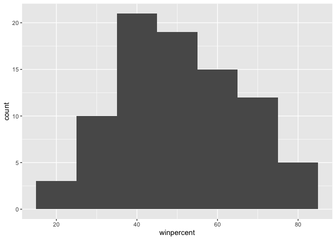
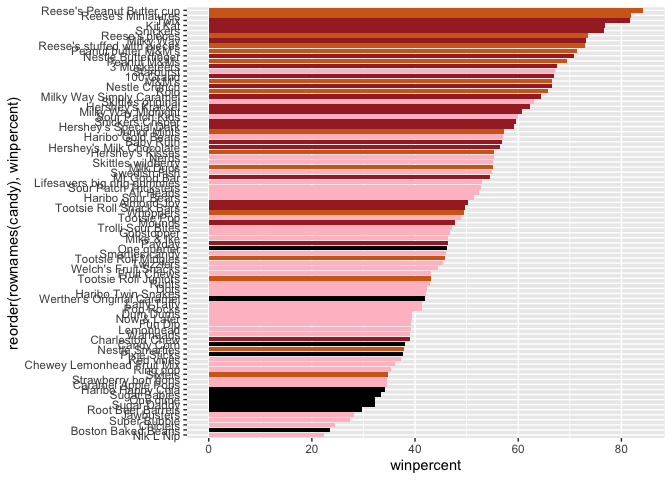
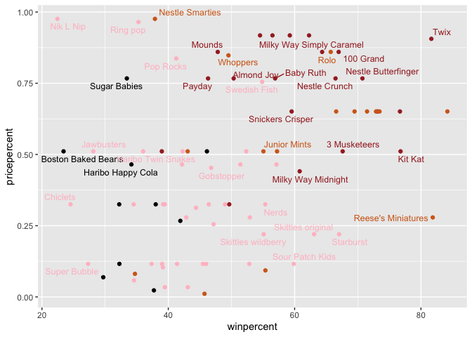
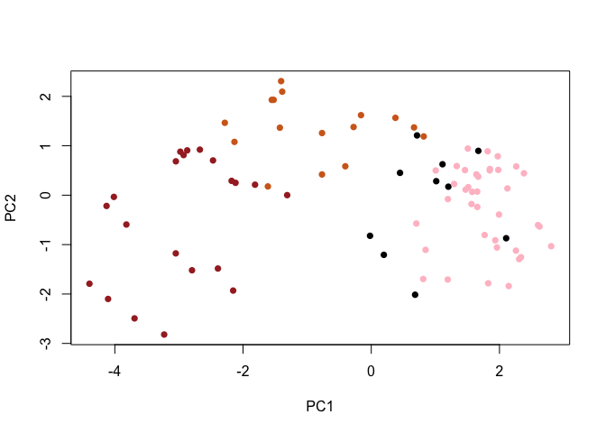
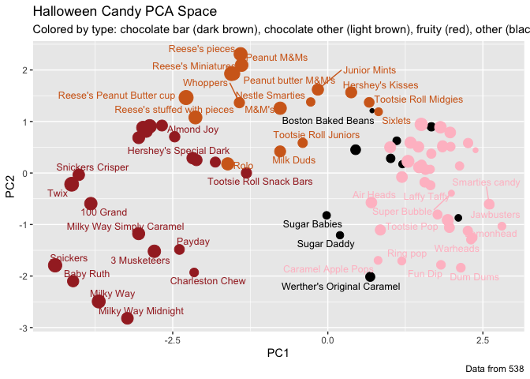

# Class 9: Candy Mini Project
Kiana Bohanon (PID: A17802316)

- [Background](#background)
- [Importing data](#importing-data)
- [What is in the dataset?](#what-is-in-the-dataset)
- [What is your favorite candy?](#what-is-your-favorite-candy)
- [Exploratory analysis](#exploratory-analysis)
- [Overall Candy Rankings](#overall-candy-rankings)
- [Adding Color](#adding-color)
- [Taking a look at pricepercent](#taking-a-look-at-pricepercent)
- [Exploring the correlation
  structure](#exploring-the-correlation-structure)
- [Principal Component Analysis](#principal-component-analysis)
- [Summary](#summary)

## Background

Our task is to explore the candy dataset to find out answers to various
questions about the datset.

## Importing data

Importing candy data by downloading the csv file, placing it in the
project directory, and then using the `read.csv()` code to check it was
inputted properly.

``` r
#read.csv("candy-data.csv")
candy_file <- "candy-data.csv"
# Next, fix the column name to match the one on the instructions by treating the first column as row names
candy = read.csv(candy_file, row.names=1)
head(candy)
```

                 chocolate fruity caramel peanutyalmondy nougat crispedricewafer
    100 Grand            1      0       1              0      0                1
    3 Musketeers         1      0       0              0      1                0
    One dime             0      0       0              0      0                0
    One quarter          0      0       0              0      0                0
    Air Heads            0      1       0              0      0                0
    Almond Joy           1      0       0              1      0                0
                 hard bar pluribus sugarpercent pricepercent winpercent
    100 Grand       0   1        0        0.732        0.860   66.97173
    3 Musketeers    0   1        0        0.604        0.511   67.60294
    One dime        0   0        0        0.011        0.116   32.26109
    One quarter     0   0        0        0.011        0.511   46.11650
    Air Heads       0   0        0        0.906        0.511   52.34146
    Almond Joy      0   1        0        0.465        0.767   50.34755

## What is in the dataset?

> Q1. How many different candy types are in this dataset?

There are 85 rows in this dataset.

> Q2. How many fruity candy types are in the dataset?

``` r
sum(candy$fruity)
```

    [1] 38

There are 38 fruity candy types in the dataset.

## What is your favorite candy?

`winpercent()` is the percentage of people who prefer a candy over
another randomly chosen candy from the dataset. Higher values indicate a
more popular candy.

For example:

``` r
candy["Twix",]$winpercent
```

    [1] 81.64291

> Q3. What is your favorite candy (other than Twix) in the dataset and
> what is it’s winpercent value?

My favorite candy is Sour Patch Kids, and it’s winpercent value is
59.864.

``` r
candy["Sour Patch Kids",]$winpercent
```

    [1] 59.864

> Q4. What is the winpercent value for “Kit Kat”?

``` r
candy["Kit Kat",]$winpercent
```

    [1] 76.7686

The winpercent value for Kit Kat is 76.7686.

> Q5. What is the winpercent value for “Tootsie Roll Snack Bars”?

``` r
candy["Tootsie Roll Snack Bars",]$winpercent
```

    [1] 49.6535

The winpercent value for Tootsie Roll Snack Bars is 49.6535.

**Side-note** the skim() function This function can give you a quick
overview of a given dataset. First install the package.

``` r
library("skimr")
# skim(candy)
```

From your use of the skim() function use the output to answer the
following:

> Q6. Is there any variable/column that looks to be on a different scale
> to the majority of the other columns in the dataset?

Yes, winpercent is out of 100 instead of 1 like the other variables.

> Q7. What do you think a zero and one represent for the
> candy\$chocolate column?

I think a zero and a one represent that the candy\$chocolate column is
totally complete and not missing anything.

## Exploratory analysis

> Q8. Plot a histogram of winpercent values

Base R:

``` r
hist(candy$winpercent)
```


ggplot:

``` r
library(ggplot2)
ggplot(candy) + aes(winpercent) + geom_histogram(binwidth=10)
```



> Q9. Is the distribution of winpercent values symmetrical?

No, it is skewed to the right.

> Q10. Is the center of the distribution above or below 50%?

``` r
summary(candy$winpercent)
```

       Min. 1st Qu.  Median    Mean 3rd Qu.    Max. 
      22.45   39.14   47.83   50.32   59.86   84.18 

The center of the distribution is below 50%, as the median is 47.83.

> Q11. On average is chocolate candy higher or lower ranked than fruit
> candy?

1.  Find all chocolate candy.
2.  Get their winpercent values and find the mean.
3.  Find all fruity candy.
4.  Get their winpercent values and find the mean.
5.  Compare the two.

``` r
choc.win <- candy$winpercent[candy$chocolate == 1]
mean(choc.win)
```

    [1] 60.92153

``` r
fruit.win <- candy$winpercent[candy$fruity == 1]
mean(fruit.win)
```

    [1] 44.11974

On average, chocolate candy is higher ranked.

> Q12. Is this difference statistically significant?

``` r
t.test(choc.win, fruit.win)
```


        Welch Two Sample t-test

    data:  choc.win and fruit.win
    t = 6.2582, df = 68.882, p-value = 2.871e-08
    alternative hypothesis: true difference in means is not equal to 0
    95 percent confidence interval:
     11.44563 22.15795
    sample estimates:
    mean of x mean of y 
     60.92153  44.11974 

## Overall Candy Rankings

> Q13. What are the five least liked candy types in this set?

``` r
head(candy[order(candy$winpercent),], n=5)
```

                       chocolate fruity caramel peanutyalmondy nougat
    Nik L Nip                  0      1       0              0      0
    Boston Baked Beans         0      0       0              1      0
    Chiclets                   0      1       0              0      0
    Super Bubble               0      1       0              0      0
    Jawbusters                 0      1       0              0      0
                       crispedricewafer hard bar pluribus sugarpercent pricepercent
    Nik L Nip                         0    0   0        1        0.197        0.976
    Boston Baked Beans                0    0   0        1        0.313        0.511
    Chiclets                          0    0   0        1        0.046        0.325
    Super Bubble                      0    0   0        0        0.162        0.116
    Jawbusters                        0    1   0        1        0.093        0.511
                       winpercent
    Nik L Nip            22.44534
    Boston Baked Beans   23.41782
    Chiclets             24.52499
    Super Bubble         27.30386
    Jawbusters           28.12744

> Q14. What are the top 5 all time favorite candy types out of this set?

``` r
tail(candy[order(candy$winpercent),], n=5)
```

                              chocolate fruity caramel peanutyalmondy nougat
    Snickers                          1      0       1              1      1
    Kit Kat                           1      0       0              0      0
    Twix                              1      0       1              0      0
    Reese's Miniatures                1      0       0              1      0
    Reese's Peanut Butter cup         1      0       0              1      0
                              crispedricewafer hard bar pluribus sugarpercent
    Snickers                                 0    0   1        0        0.546
    Kit Kat                                  1    0   1        0        0.313
    Twix                                     1    0   1        0        0.546
    Reese's Miniatures                       0    0   0        0        0.034
    Reese's Peanut Butter cup                0    0   0        0        0.720
                              pricepercent winpercent
    Snickers                         0.651   76.67378
    Kit Kat                          0.511   76.76860
    Twix                             0.906   81.64291
    Reese's Miniatures               0.279   81.86626
    Reese's Peanut Butter cup        0.651   84.18029

> Q15. Make a first barplot of candy ranking based on winpercent values.

``` r
library(ggplot2)
ggplot(candy) + aes(winpercent, rownames(candy)) + geom_col()
```


> Q16. This is quite ugly, use the reorder() function to get the bars
> sorted by winpercent?

``` r
library(ggplot2)
ggplot(candy) + aes(winpercent, reorder(rownames(candy),winpercent)) + geom_col()
```


## Adding Color

``` r
my_cols=rep("black", nrow(candy))
my_cols[as.logical(candy$chocolate)] = "chocolate"
my_cols[as.logical(candy$bar)] = "brown"
my_cols[as.logical(candy$fruity)] = "pink"

ggplot(candy) + 
  aes(winpercent, reorder(rownames(candy),winpercent)) +
  geom_col(fill=my_cols) 
```



Now, for the first time, using this plot we can answer questions like:

> Q17. What is the worst ranked chocolate candy?

The worst ranked chocolate candy is Sixlets.

> Q18. What is the best ranked fruity candy?

The best ranked fruity candy is Starburst.

## Taking a look at pricepercent

We can examine the value for money, or what the best candy is for the
least amount of money.

``` r
library(ggrepel)

# How about a plot of win vs price
ggplot(candy) +
  aes(winpercent, pricepercent, label=rownames(candy)) +
  geom_point(col=my_cols) + 
  geom_text_repel(col=my_cols, size=3.3, max.overlaps = 5)
```

    Warning: ggrepel: 50 unlabeled data points (too many overlaps). Consider
    increasing max.overlaps



> Q19. Which candy type is the highest ranked in terms of winpercent for
> the least money - i.e. offers the most bang for your buck?

Reese’s Miniatures

> Q20. What are the top 5 most expensive candy types in the dataset and
> of these which is the least popular?

``` r
ord <- order(candy$pricepercent, decreasing = TRUE)
head( candy[ord,c(11,12)], n=5 )
```

                             pricepercent winpercent
    Nik L Nip                       0.976   22.44534
    Nestle Smarties                 0.976   37.88719
    Ring pop                        0.965   35.29076
    Hershey's Krackel               0.918   62.28448
    Hershey's Milk Chocolate        0.918   56.49050

Of these, the least popular is Nik L Nip.

## Exploring the correlation structure

We can use correlation to view the results with the **corrplot** package
to plot a correlation matrix.

``` r
library(corrplot)
```

    corrplot 0.95 loaded

``` r
cij <- cor(candy)
corrplot(cij)
```


> Q22. Examining this plot what two variables are anti-correlated
> (i.e. have minus values)?

Examining this plot, two variables that are anti-correlated are fruity
and chocolate.

> Q23. Similarly, what two variables are most positively correlated?

Two variables that are most positively correlated are winpercent and
chocolate.

## Principal Component Analysis

Let’s apply PCA using the `prcomp()` function to our candy dataset.

``` r
pca <- prcomp(candy, scale=TRUE)
summary(pca)
```

    Importance of components:
                              PC1    PC2    PC3     PC4    PC5     PC6     PC7
    Standard deviation     2.0788 1.1378 1.1092 1.07533 0.9518 0.81923 0.81530
    Proportion of Variance 0.3601 0.1079 0.1025 0.09636 0.0755 0.05593 0.05539
    Cumulative Proportion  0.3601 0.4680 0.5705 0.66688 0.7424 0.79830 0.85369
                               PC8     PC9    PC10    PC11    PC12
    Standard deviation     0.74530 0.67824 0.62349 0.43974 0.39760
    Proportion of Variance 0.04629 0.03833 0.03239 0.01611 0.01317
    Cumulative Proportion  0.89998 0.93832 0.97071 0.98683 1.00000

Now we can plot our main PCA score plot of PC1 vs. PC2.

``` r
plot(pca$x[,1:2])
```


We can change the plotting character and add some color:

``` r
plot(pca$x[,1:2], col=my_cols, pch=16)
```



> ggplot works best when you supply an input data.frame that includes a
> separate coloumn for each of the aesthetics you would like displayed
> in your final plot. To do this, we make a new data.frame that contains
> our PCA results with all the rest of our candy data.

``` r
# Make a new data-frame with our PCA results and candy data
my_data <- cbind(candy, pca$x[,1:3])

p <- ggplot(my_data) + 
        aes(x=PC1, y=PC2, 
            size=winpercent/100,  
            text=rownames(my_data),
            label=rownames(my_data)) +
        geom_point(col=my_cols)
p
```


We can use the ggrepel package and the function
`ggrepel::geom_text_repel()` to label the plot.

``` r
library(ggrepel)

p + geom_text_repel(size=3.3, col=my_cols, max.overlaps = 7)  + 
  theme(legend.position = "none") +
  labs(title="Halloween Candy PCA Space",
       subtitle="Colored by type: chocolate bar (dark brown), chocolate other (light brown), fruity (red), other (black)",
       caption="Data from 538")
```

    Warning: ggrepel: 39 unlabeled data points (too many overlaps). Consider
    increasing max.overlaps



You can also generate an interactive plot that you can mouse over to see
labels:

``` r
#library(plotly)
#ggplotly(p)
```

Take a quick look at PCA our loadings.

``` r
ggplot(pca$rotation) +
  aes(x=PC1, y=reorder(rownames(pca$rotation), PC1)) +
  geom_col()
```


> Q24. Complete the code to generate the loadings plot above. What
> original variables are picked up strongly by PC1 in the positive
> direction? Do these make sense to you? Where did you see this
> relationship highlighted previously?

The variables that are picked up strongly by PC1 in the positive
direction are fruity, pluribus, and hard. This makes sense to me because
fruity candy is usually hard and comes in multiples (i.e. Skittles and
Starburst). We saw this relationship highlighted previously in the
correlation figure from the corrplot package.

## Summary

> Q25. Based on your exploratory analysis, correlation findings, and PCA
> results, what combination of characteristics appears to make a
> “winning” candy? How do these different analyses (visualization,
> correlation, PCA) support or complement each other in reaching this
> conclusion?

Based on these analyses, a “winning” candy tends to be a combination of
chocolate and bar, but not fruity. The visualizations in histograms and
bar plots show that candy with chocolate tends to have a high
winpercent. The correlation analysis also supports this by showing
positive correlation between winpercent and chocolate. The PCA also
supports this by showing that the characteristics of chocolate and bar
are in the same direction and strength, indicating they are correlated
features that contribute positively to overall candy preference.
