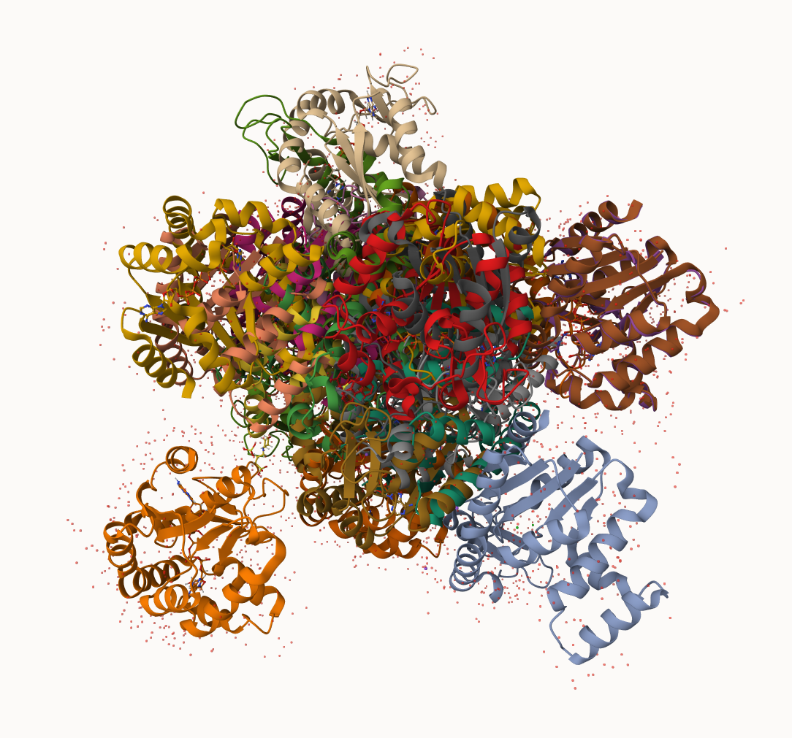

# Class 10: Structural Bioinformatics (Pt. 1)
Kiana Bohanon (PID: A17802316)

- [1: Introduction to the RCSB Protein Data Bank
  (PDB)](#1-introduction-to-the-rcsb-protein-data-bank-pdb)
- [Visualizing the HIV-1 Protease
  Structure](#visualizing-the-hiv-1-protease-structure)
- [Introduction to Bio3D in R for Structural
  Bioinformatics](#introduction-to-bio3d-in-r-for-structural-bioinformatics)
- [Predicting functional motions of a single
  structure](#predicting-functional-motions-of-a-single-structure)
- [Comparative Analysis with PCA](#comparative-analysis-with-pca)
- [PCA](#pca)

## 1: Introduction to the RCSB Protein Data Bank (PDB)

Download a CSV file from the PDB site (accessible from “Analyze” \> “PDB
Statistics” \> “by Experimental Method and Molecular Type”. Move this
CSV file into your RStudio project and use it to answer the following
questions:

``` r
stats <- read.csv("Data Export Summary.csv")
stats
```

               Molecular.Type   X.ray     EM    NMR Integrative Multiple.methods
    1          Protein (only) 178,795 21,825 12,773         343              226
    2 Protein/Oligosaccharide  10,363  3,564     34           8               11
    3              Protein/NA   9,106  6,335    287          24                7
    4     Nucleic acid (only)   3,132    221  1,566           3               15
    5                   Other     175     25     33           4                0
    6  Oligosaccharide (only)      11      0      6           0                1
      Neutron Other   Total
    1      84    32 214,078
    2       1     0  13,981
    3       0     0  15,759
    4       3     1   4,941
    5       0     0     237
    6       0     4      22

The comma in these numbers leads to the numbers here being read as
characters.

``` r
library(readr)
stats <- read_csv("Data Export Summary.csv")
```

    Rows: 6 Columns: 9
    ── Column specification ────────────────────────────────────────────────────────
    Delimiter: ","
    chr (1): Molecular Type
    dbl (4): Integrative, Multiple methods, Neutron, Other
    num (4): X-ray, EM, NMR, Total

    ℹ Use `spec()` to retrieve the full column specification for this data.
    ℹ Specify the column types or set `show_col_types = FALSE` to quiet this message.

``` r
stats
```

    # A tibble: 6 × 9
      `Molecular Type`    `X-ray`    EM   NMR Integrative `Multiple methods` Neutron
      <chr>                 <dbl> <dbl> <dbl>       <dbl>              <dbl>   <dbl>
    1 Protein (only)       178795 21825 12773         343                226      84
    2 Protein/Oligosacch…   10363  3564    34           8                 11       1
    3 Protein/NA             9106  6335   287          24                  7       0
    4 Nucleic acid (only)    3132   221  1566           3                 15       3
    5 Other                   175    25    33           4                  0       0
    6 Oligosaccharide (o…      11     0     6           0                  1       0
    # ℹ 2 more variables: Other <dbl>, Total <dbl>

> Q1: What percentage of structures in the PDB are solved by X-Ray and
> Electron Microscopy.

``` r
sum(stats$`X-ray`)/sum(stats$Total)*100
```

    [1] 80.95077

``` r
sum(stats$EM)/sum(stats$Total)*100
```

    [1] 12.83843

The percentage of structures in the PDB that are solved by X-ray are
80.95% and by EM are 12.83%.

> Q2: What proportion of structures in the PDB are protein?

``` r
stats[1,9]/(sum(stats$Total))
```

          Total
    1 0.8596889

The proportion of structures in the PDB that are protein are 0.8596.

> Q3. SKIP

## Visualizing the HIV-1 Protease Structure

We can use the Molstar viewer online: https://molstar.org/viewer/


> Q6. A new clean image showing the catalytic ASP25 amino acids in both
> chains of the HIV-PR dimer along with the inhibitor and all important
> active site water.


## Introduction to Bio3D in R for Structural Bioinformatics

> Q4: Water molecules normally have 3 atoms. Why do we see just one atom
> per water molecule in this structure?

To make the visual easier to see.

> Q5: There is a critical “conserved” water molecule in the binding
> site. Can you identify this water molecule? What residue number does
> this water molecule have.

1608. 

``` r
library(bio3d)
pdb <- read.pdb("1hsg")
```

      Note: Accessing on-line PDB file

``` r
pdb
```


     Call:  read.pdb(file = "1hsg")

       Total Models#: 1
         Total Atoms#: 1686,  XYZs#: 5058  Chains#: 2  (values: A B)

         Protein Atoms#: 1514  (residues/Calpha atoms#: 198)
         Nucleic acid Atoms#: 0  (residues/phosphate atoms#: 0)

         Non-protein/nucleic Atoms#: 172  (residues: 128)
         Non-protein/nucleic resid values: [ HOH (127), MK1 (1) ]

       Protein sequence:
          PQITLWQRPLVTIKIGGQLKEALLDTGADDTVLEEMSLPGRWKPKMIGGIGGFIKVRQYD
          QILIEICGHKAIGTVLVGPTPVNIIGRNLLTQIGCTLNFPQITLWQRPLVTIKIGGQLKE
          ALLDTGADDTVLEEMSLPGRWKPKMIGGIGGFIKVRQYDQILIEICGHKAIGTVLVGPTP
          VNIIGRNLLTQIGCTLNF

    + attr: atom, xyz, seqres, helix, sheet,
            calpha, remark, call

> Q7: How many amino acid residues are there in this pdb object?

There are 198 amino acid residues.

> Q8: Name one of the two non-protein residues?

One of the non-protein residues are MK1.

> Q9: How many protein chains are in this structure?

There are 2 protein chains.

``` r
head(pdb$atom)
```

      type eleno elety  alt resid chain resno insert      x      y     z o     b
    1 ATOM     1     N <NA>   PRO     A     1   <NA> 29.361 39.686 5.862 1 38.10
    2 ATOM     2    CA <NA>   PRO     A     1   <NA> 30.307 38.663 5.319 1 40.62
    3 ATOM     3     C <NA>   PRO     A     1   <NA> 29.760 38.071 4.022 1 42.64
    4 ATOM     4     O <NA>   PRO     A     1   <NA> 28.600 38.302 3.676 1 43.40
    5 ATOM     5    CB <NA>   PRO     A     1   <NA> 30.508 37.541 6.342 1 37.87
    6 ATOM     6    CG <NA>   PRO     A     1   <NA> 29.296 37.591 7.162 1 38.40
      segid elesy charge
    1  <NA>     N   <NA>
    2  <NA>     C   <NA>
    3  <NA>     C   <NA>
    4  <NA>     O   <NA>
    5  <NA>     C   <NA>
    6  <NA>     C   <NA>

``` r
library(bio3dview)

#view.pdb(pdb)
```

``` r
# Select the important ASP 25 residue
#sele <- atom.select(pdb, resno=25)

# and highlight them in spacefill representation
#view.pdb(pdb, cols=c("navy","teal"), 
        # highlight = sele,
        # highlight.style = "spacefill")
```

## Predicting functional motions of a single structure

Read an ADK structure from the PDB database:

``` r
adk <- read.pdb("6s36")
```

      Note: Accessing on-line PDB file
       PDB has ALT records, taking A only, rm.alt=TRUE

``` r
adk
```


     Call:  read.pdb(file = "6s36")

       Total Models#: 1
         Total Atoms#: 1898,  XYZs#: 5694  Chains#: 1  (values: A)

         Protein Atoms#: 1654  (residues/Calpha atoms#: 214)
         Nucleic acid Atoms#: 0  (residues/phosphate atoms#: 0)

         Non-protein/nucleic Atoms#: 244  (residues: 244)
         Non-protein/nucleic resid values: [ CL (3), HOH (238), MG (2), NA (1) ]

       Protein sequence:
          MRIILLGAPGAGKGTQAQFIMEKYGIPQISTGDMLRAAVKSGSELGKQAKDIMDAGKLVT
          DELVIALVKERIAQEDCRNGFLLDGFPRTIPQADAMKEAGINVDYVLEFDVPDELIVDKI
          VGRRVHAPSGRVYHVKFNPPKVEGKDDVTGEELTTRKDDQEETVRKRLVEYHQMTAPLIG
          YYSKEAEAGNTKYAKVDGTKPVAEVRADLEKILG

    + attr: atom, xyz, seqres, helix, sheet,
            calpha, remark, call

``` r
m <- nma(adk)
```

     Building Hessian...        Done in 0.013 seconds.
     Diagonalizing Hessian...   Done in 0.067 seconds.

``` r
plot(m)
```


Write out our results as a trajectory/movie of predicted motions:

``` r
#mktrj(m, file="adk_m7.pdb")
```

## Comparative Analysis with PCA

First step: find an ADK sequence

``` r
library(bio3d)
id <- "1ake_A" ## Change this to run a different analysis
aa <- get.seq( id )
```

    Warning in get.seq(id): Removing existing file: seqs.fasta

    Fetching... Please wait. Done.

Next step: search the PDB database for all related entries:

``` r
#blast <- blast.pdb(aa)
#hits <- plot(blast)
hits <- NULL
hits$pdb.id <- c('1AKE_A','6S36_A','6RZE_A','3HPR_A','1E4V_A','5EJE_A','1E4Y_A','3X2S_A','6HAP_A','6HAM_A','4K46_A','3GMT_A','4PZL_A')
```

``` r
#head (blast$hit.tbl)
```

The “top hits” are in the `hits` object. Now we can download these to
our computer. Put these in a sub-folder (directory) called “pdbs” and we
use gzip to speed things up.

``` r
# Download releated PDB files
files <- get.pdb(hits$pdb.id, path="pdbs", split=TRUE, gzip=TRUE)
```

    Warning in get.pdb(hits$pdb.id, path = "pdbs", split = TRUE, gzip = TRUE):
    pdbs/1AKE.pdb.gz exists. Skipping download

    Warning in get.pdb(hits$pdb.id, path = "pdbs", split = TRUE, gzip = TRUE):
    pdbs/6S36.pdb.gz exists. Skipping download

    Warning in get.pdb(hits$pdb.id, path = "pdbs", split = TRUE, gzip = TRUE):
    pdbs/6RZE.pdb.gz exists. Skipping download

    Warning in get.pdb(hits$pdb.id, path = "pdbs", split = TRUE, gzip = TRUE):
    pdbs/3HPR.pdb.gz exists. Skipping download

    Warning in get.pdb(hits$pdb.id, path = "pdbs", split = TRUE, gzip = TRUE):
    pdbs/1E4V.pdb.gz exists. Skipping download

    Warning in get.pdb(hits$pdb.id, path = "pdbs", split = TRUE, gzip = TRUE):
    pdbs/5EJE.pdb.gz exists. Skipping download

    Warning in get.pdb(hits$pdb.id, path = "pdbs", split = TRUE, gzip = TRUE):
    pdbs/1E4Y.pdb.gz exists. Skipping download

    Warning in get.pdb(hits$pdb.id, path = "pdbs", split = TRUE, gzip = TRUE):
    pdbs/3X2S.pdb.gz exists. Skipping download

    Warning in get.pdb(hits$pdb.id, path = "pdbs", split = TRUE, gzip = TRUE):
    pdbs/6HAP.pdb.gz exists. Skipping download

    Warning in get.pdb(hits$pdb.id, path = "pdbs", split = TRUE, gzip = TRUE):
    pdbs/6HAM.pdb.gz exists. Skipping download

    Warning in get.pdb(hits$pdb.id, path = "pdbs", split = TRUE, gzip = TRUE):
    pdbs/4K46.pdb.gz exists. Skipping download


      |                                                                            
      |                                                                      |   0%
      |                                                                            
      |=====                                                                 |   8%
      |                                                                            
      |===========                                                           |  15%
      |                                                                            
      |================                                                      |  23%
      |                                                                            
      |======================                                                |  31%
      |                                                                            
      |===========================                                           |  38%
      |                                                                            
      |================================                                      |  46%
      |                                                                            
      |======================================                                |  54%
      |                                                                            
      |===========================================                           |  62%
      |                                                                            
      |================================================                      |  69%
      |                                                                            
      |======================================================                |  77%
      |                                                                            
      |===========================================================           |  85%
      |                                                                            
      |=================================================================     |  92%
      |                                                                            
      |======================================================================| 100%

These look like a hot mess:



Next we will use the pdbaln() function to align and also optionally fit
(i.e. superpose) the identified PDB structures.

This requires a BioCondoctor package called “msa” that we need to
install. First we install BiocManager. Then we use
`BiocManager::install("msa")`

``` r
# Align releated PDBs
pdbs <- pdbaln(files, fit = TRUE, exefile="msa")
```

    Reading PDB files:
    pdbs/split_chain/1AKE_A.pdb
    pdbs/split_chain/6S36_A.pdb
    pdbs/split_chain/6RZE_A.pdb
    pdbs/split_chain/3HPR_A.pdb
    pdbs/split_chain/1E4V_A.pdb
    pdbs/split_chain/5EJE_A.pdb
    pdbs/split_chain/1E4Y_A.pdb
    pdbs/split_chain/3X2S_A.pdb
    pdbs/split_chain/6HAP_A.pdb
    pdbs/split_chain/6HAM_A.pdb
    pdbs/split_chain/4K46_A.pdb
    pdbs/split_chain/3GMT_A.pdb
    pdbs/split_chain/4PZL_A.pdb
       PDB has ALT records, taking A only, rm.alt=TRUE
    .   PDB has ALT records, taking A only, rm.alt=TRUE
    .   PDB has ALT records, taking A only, rm.alt=TRUE
    .   PDB has ALT records, taking A only, rm.alt=TRUE
    ..   PDB has ALT records, taking A only, rm.alt=TRUE
    ....   PDB has ALT records, taking A only, rm.alt=TRUE
    .   PDB has ALT records, taking A only, rm.alt=TRUE
    ...

    Extracting sequences

    pdb/seq: 1   name: pdbs/split_chain/1AKE_A.pdb 
       PDB has ALT records, taking A only, rm.alt=TRUE
    pdb/seq: 2   name: pdbs/split_chain/6S36_A.pdb 
       PDB has ALT records, taking A only, rm.alt=TRUE
    pdb/seq: 3   name: pdbs/split_chain/6RZE_A.pdb 
       PDB has ALT records, taking A only, rm.alt=TRUE
    pdb/seq: 4   name: pdbs/split_chain/3HPR_A.pdb 
       PDB has ALT records, taking A only, rm.alt=TRUE
    pdb/seq: 5   name: pdbs/split_chain/1E4V_A.pdb 
    pdb/seq: 6   name: pdbs/split_chain/5EJE_A.pdb 
       PDB has ALT records, taking A only, rm.alt=TRUE
    pdb/seq: 7   name: pdbs/split_chain/1E4Y_A.pdb 
    pdb/seq: 8   name: pdbs/split_chain/3X2S_A.pdb 
    pdb/seq: 9   name: pdbs/split_chain/6HAP_A.pdb 
    pdb/seq: 10   name: pdbs/split_chain/6HAM_A.pdb 
       PDB has ALT records, taking A only, rm.alt=TRUE
    pdb/seq: 11   name: pdbs/split_chain/4K46_A.pdb 
       PDB has ALT records, taking A only, rm.alt=TRUE
    pdb/seq: 12   name: pdbs/split_chain/3GMT_A.pdb 
    pdb/seq: 13   name: pdbs/split_chain/4PZL_A.pdb 

Have a peek at the new alignment object `pdbs`

``` r
pdbs
```

                                    1        .         .         .         40 
    [Truncated_Name:1]1AKE_A.pdb    ----------MRIILLGAPGAGKGTQAQFIMEKYGIPQIS
    [Truncated_Name:2]6S36_A.pdb    ----------MRIILLGAPGAGKGTQAQFIMEKYGIPQIS
    [Truncated_Name:3]6RZE_A.pdb    ----------MRIILLGAPGAGKGTQAQFIMEKYGIPQIS
    [Truncated_Name:4]3HPR_A.pdb    ----------MRIILLGAPGAGKGTQAQFIMEKYGIPQIS
    [Truncated_Name:5]1E4V_A.pdb    ----------MRIILLGAPVAGKGTQAQFIMEKYGIPQIS
    [Truncated_Name:6]5EJE_A.pdb    ----------MRIILLGAPGAGKGTQAQFIMEKYGIPQIS
    [Truncated_Name:7]1E4Y_A.pdb    ----------MRIILLGALVAGKGTQAQFIMEKYGIPQIS
    [Truncated_Name:8]3X2S_A.pdb    ----------MRIILLGAPGAGKGTQAQFIMEKYGIPQIS
    [Truncated_Name:9]6HAP_A.pdb    ----------MRIILLGAPGAGKGTQAQFIMEKYGIPQIS
    [Truncated_Name:10]6HAM_A.pdb   ----------MRIILLGAPGAGKGTQAQFIMEKYGIPQIS
    [Truncated_Name:11]4K46_A.pdb   ----------MRIILLGAPGAGKGTQAQFIMAKFGIPQIS
    [Truncated_Name:12]3GMT_A.pdb   ----------MRLILLGAPGAGKGTQANFIKEKFGIPQIS
    [Truncated_Name:13]4PZL_A.pdb   TENLYFQSNAMRIILLGAPGAGKGTQAKIIEQKYNIAHIS
                                              **^*****  *******  *  *^ *  ** 
                                    1        .         .         .         40 

                                   41        .         .         .         80 
    [Truncated_Name:1]1AKE_A.pdb    TGDMLRAAVKSGSELGKQAKDIMDAGKLVTDELVIALVKE
    [Truncated_Name:2]6S36_A.pdb    TGDMLRAAVKSGSELGKQAKDIMDAGKLVTDELVIALVKE
    [Truncated_Name:3]6RZE_A.pdb    TGDMLRAAVKSGSELGKQAKDIMDAGKLVTDELVIALVKE
    [Truncated_Name:4]3HPR_A.pdb    TGDMLRAAVKSGSELGKQAKDIMDAGKLVTDELVIALVKE
    [Truncated_Name:5]1E4V_A.pdb    TGDMLRAAVKSGSELGKQAKDIMDAGKLVTDELVIALVKE
    [Truncated_Name:6]5EJE_A.pdb    TGDMLRAAVKSGSELGKQAKDIMDACKLVTDELVIALVKE
    [Truncated_Name:7]1E4Y_A.pdb    TGDMLRAAVKSGSELGKQAKDIMDAGKLVTDELVIALVKE
    [Truncated_Name:8]3X2S_A.pdb    TGDMLRAAVKSGSELGKQAKDIMDCGKLVTDELVIALVKE
    [Truncated_Name:9]6HAP_A.pdb    TGDMLRAAVKSGSELGKQAKDIMDAGKLVTDELVIALVRE
    [Truncated_Name:10]6HAM_A.pdb   TGDMLRAAIKSGSELGKQAKDIMDAGKLVTDEIIIALVKE
    [Truncated_Name:11]4K46_A.pdb   TGDMLRAAIKAGTELGKQAKSVIDAGQLVSDDIILGLVKE
    [Truncated_Name:12]3GMT_A.pdb   TGDMLRAAVKAGTPLGVEAKTYMDEGKLVPDSLIIGLVKE
    [Truncated_Name:13]4PZL_A.pdb   TGDMIRETIKSGSALGQELKKVLDAGELVSDEFIIKIVKD
                                    ****^*  ^* *^ **   *  ^*   ** *  ^^ ^*^^ 
                                   41        .         .         .         80 

                                   81        .         .         .         120 
    [Truncated_Name:1]1AKE_A.pdb    RIAQEDCRNGFLLDGFPRTIPQADAMKEAGINVDYVLEFD
    [Truncated_Name:2]6S36_A.pdb    RIAQEDCRNGFLLDGFPRTIPQADAMKEAGINVDYVLEFD
    [Truncated_Name:3]6RZE_A.pdb    RIAQEDCRNGFLLDGFPRTIPQADAMKEAGINVDYVLEFD
    [Truncated_Name:4]3HPR_A.pdb    RIAQEDCRNGFLLDGFPRTIPQADAMKEAGINVDYVLEFD
    [Truncated_Name:5]1E4V_A.pdb    RIAQEDCRNGFLLDGFPRTIPQADAMKEAGINVDYVLEFD
    [Truncated_Name:6]5EJE_A.pdb    RIAQEDCRNGFLLDGFPRTIPQADAMKEAGINVDYVLEFD
    [Truncated_Name:7]1E4Y_A.pdb    RIAQEDCRNGFLLDGFPRTIPQADAMKEAGINVDYVLEFD
    [Truncated_Name:8]3X2S_A.pdb    RIAQEDSRNGFLLDGFPRTIPQADAMKEAGINVDYVLEFD
    [Truncated_Name:9]6HAP_A.pdb    RICQEDSRNGFLLDGFPRTIPQADAMKEAGINVDYVLEFD
    [Truncated_Name:10]6HAM_A.pdb   RICQEDSRNGFLLDGFPRTIPQADAMKEAGINVDYVLEFD
    [Truncated_Name:11]4K46_A.pdb   RIAQDDCAKGFLLDGFPRTIPQADGLKEVGVVVDYVIEFD
    [Truncated_Name:12]3GMT_A.pdb   RLKEADCANGYLFDGFPRTIAQADAMKEAGVAIDYVLEID
    [Truncated_Name:13]4PZL_A.pdb   RISKNDCNNGFLLDGVPRTIPQAQELDKLGVNIDYIVEVD
                                    *^   *   *^* ** **** **  ^   *^ ^**^^* * 
                                   81        .         .         .         120 

                                  121        .         .         .         160 
    [Truncated_Name:1]1AKE_A.pdb    VPDELIVDRIVGRRVHAPSGRVYHVKFNPPKVEGKDDVTG
    [Truncated_Name:2]6S36_A.pdb    VPDELIVDKIVGRRVHAPSGRVYHVKFNPPKVEGKDDVTG
    [Truncated_Name:3]6RZE_A.pdb    VPDELIVDAIVGRRVHAPSGRVYHVKFNPPKVEGKDDVTG
    [Truncated_Name:4]3HPR_A.pdb    VPDELIVDRIVGRRVHAPSGRVYHVKFNPPKVEGKDDGTG
    [Truncated_Name:5]1E4V_A.pdb    VPDELIVDRIVGRRVHAPSGRVYHVKFNPPKVEGKDDVTG
    [Truncated_Name:6]5EJE_A.pdb    VPDELIVDRIVGRRVHAPSGRVYHVKFNPPKVEGKDDVTG
    [Truncated_Name:7]1E4Y_A.pdb    VPDELIVDRIVGRRVHAPSGRVYHVKFNPPKVEGKDDVTG
    [Truncated_Name:8]3X2S_A.pdb    VPDELIVDRIVGRRVHAPSGRVYHVKFNPPKVEGKDDVTG
    [Truncated_Name:9]6HAP_A.pdb    VPDELIVDRIVGRRVHAPSGRVYHVKFNPPKVEGKDDVTG
    [Truncated_Name:10]6HAM_A.pdb   VPDELIVDRIVGRRVHAPSGRVYHVKFNPPKVEGKDDVTG
    [Truncated_Name:11]4K46_A.pdb   VADSVIVERMAGRRAHLASGRTYHNVYNPPKVEGKDDVTG
    [Truncated_Name:12]3GMT_A.pdb   VPFSEIIERMSGRRTHPASGRTYHVKFNPPKVEGKDDVTG
    [Truncated_Name:13]4PZL_A.pdb   VADNLLIERITGRRIHPASGRTYHTKFNPPKVADKDDVTG
                                    *    ^^^ ^ *** *  *** **  ^*****  *** ** 
                                  121        .         .         .         160 

                                  161        .         .         .         200 
    [Truncated_Name:1]1AKE_A.pdb    EELTTRKDDQEETVRKRLVEYHQMTAPLIGYYSKEAEAGN
    [Truncated_Name:2]6S36_A.pdb    EELTTRKDDQEETVRKRLVEYHQMTAPLIGYYSKEAEAGN
    [Truncated_Name:3]6RZE_A.pdb    EELTTRKDDQEETVRKRLVEYHQMTAPLIGYYSKEAEAGN
    [Truncated_Name:4]3HPR_A.pdb    EELTTRKDDQEETVRKRLVEYHQMTAPLIGYYSKEAEAGN
    [Truncated_Name:5]1E4V_A.pdb    EELTTRKDDQEETVRKRLVEYHQMTAPLIGYYSKEAEAGN
    [Truncated_Name:6]5EJE_A.pdb    EELTTRKDDQEECVRKRLVEYHQMTAPLIGYYSKEAEAGN
    [Truncated_Name:7]1E4Y_A.pdb    EELTTRKDDQEETVRKRLVEYHQMTAPLIGYYSKEAEAGN
    [Truncated_Name:8]3X2S_A.pdb    EELTTRKDDQEETVRKRLCEYHQMTAPLIGYYSKEAEAGN
    [Truncated_Name:9]6HAP_A.pdb    EELTTRKDDQEETVRKRLVEYHQMTAPLIGYYSKEAEAGN
    [Truncated_Name:10]6HAM_A.pdb   EELTTRKDDQEETVRKRLVEYHQMTAPLIGYYSKEAEAGN
    [Truncated_Name:11]4K46_A.pdb   EDLVIREDDKEETVLARLGVYHNQTAPLIAYYGKEAEAGN
    [Truncated_Name:12]3GMT_A.pdb   EPLVQRDDDKEETVKKRLDVYEAQTKPLITYYGDWARRGA
    [Truncated_Name:13]4PZL_A.pdb   EPLITRTDDNEDTVKQRLSVYHAQTAKLIDFYRNFSSTNT
                                    * *  * ** *^ *  **  *   *  ** ^*         
                                  161        .         .         .         200 

                                  201        .         .      227 
    [Truncated_Name:1]1AKE_A.pdb    T--KYAKVDGTKPVAEVRADLEKILG-
    [Truncated_Name:2]6S36_A.pdb    T--KYAKVDGTKPVAEVRADLEKILG-
    [Truncated_Name:3]6RZE_A.pdb    T--KYAKVDGTKPVAEVRADLEKILG-
    [Truncated_Name:4]3HPR_A.pdb    T--KYAKVDGTKPVAEVRADLEKILG-
    [Truncated_Name:5]1E4V_A.pdb    T--KYAKVDGTKPVAEVRADLEKILG-
    [Truncated_Name:6]5EJE_A.pdb    T--KYAKVDGTKPVAEVRADLEKILG-
    [Truncated_Name:7]1E4Y_A.pdb    T--KYAKVDGTKPVAEVRADLEKILG-
    [Truncated_Name:8]3X2S_A.pdb    T--KYAKVDGTKPVAEVRADLEKILG-
    [Truncated_Name:9]6HAP_A.pdb    T--KYAKVDGTKPVCEVRADLEKILG-
    [Truncated_Name:10]6HAM_A.pdb   T--KYAKVDGTKPVCEVRADLEKILG-
    [Truncated_Name:11]4K46_A.pdb   T--QYLKFDGTKAVAEVSAELEKALA-
    [Truncated_Name:12]3GMT_A.pdb   E-------NGLKAPA-----YRKISG-
    [Truncated_Name:13]4PZL_A.pdb   KIPKYIKINGDQAVEKVSQDIFDQLNK
                                             *                  
                                  201        .         .      227 

    Call:
      pdbaln(files = files, fit = TRUE, exefile = "msa")

    Class:
      pdbs, fasta

    Alignment dimensions:
      13 sequence rows; 227 position columns (204 non-gap, 23 gap) 

    + attr: xyz, resno, b, chain, id, ali, resid, sse, call

We could view these in R with **bio3dview** `view.pdbs()` function.

``` r
#library(bio3dview)
#view.pdbs(pdbs, colorScheme = "residue")
```

## PCA

We can run PCA on our `pdbs` object using the `pca()` function from
**bio3d**:

``` r
# Perform PCA
pc.xray <- pca(pdbs)
plot(pc.xray)
```


``` r
plot(pc.xray, 1:2)
```


We can make a visualization of the major conformational difference
(i.e. large scale structure change) captures by our PCA analysis with
the `mktrj()` function.

``` r
pc1 <- mktrj(pc.xray, file="pca.pdb")
```

Let’s view this in molstar.
