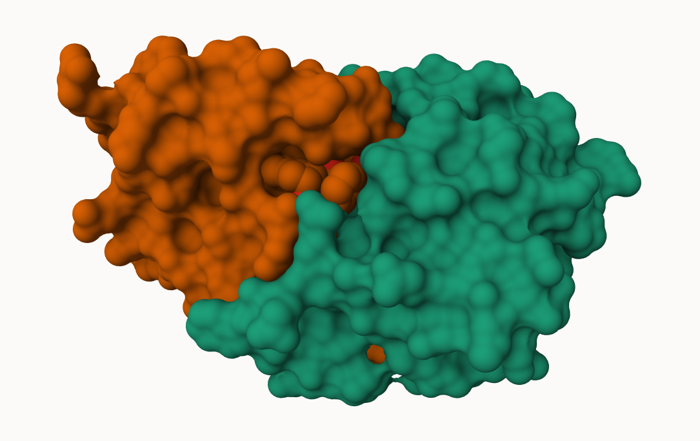
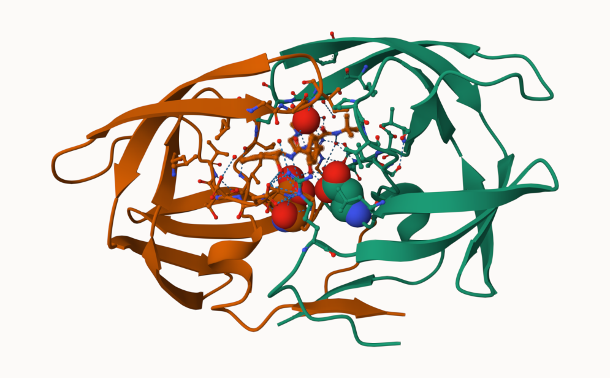

## 1: Introduction to the RCSB Protein Data Bank (PDB)

Download a CSV file from the PDB site (accessible from “Analyze” > “PDB Statistics” > “by Experimental Method and Molecular Type”. Move this CSV file into your RStudio project and use it to answer the following questions:
```{r}
stats <- read.csv("Data Export Summary.csv")
stats
```

The comma in these numbers leads to the numbers here being read as characters.
```{r}
library(readr)
stats <- read_csv("Data Export Summary.csv")
stats

```

> Q1: What percentage of structures in the PDB are solved by X-Ray and Electron Microscopy.

```{r}
sum(stats$`X-ray`)/sum(stats$Total)*100
sum(stats$EM)/sum(stats$Total)*100
```
The percentage of structures in the PDB that are solved by X-ray are 80.95% and by EM are 12.83%.

> Q2: What proportion of structures in the PDB are protein?

```{r}
stats[1,9]/(sum(stats$Total))
```
The proportion of structures in the PDB that are protein are 0.8596.

> Q3. SKIP

## Visualizing the HIV-1 Protease Structure

We can use the Molstar viewer online: https://molstar.org/viewer/



> Q6. A new clean image showing the catalytic ASP25 amino acids in both chains of the HIV-PR dimer along with the inhibitor and all important active site water.



## Introduction to Bio3D in R for Structural Bioinformatics

> Q4: Water molecules normally have 3 atoms. Why do we see just one atom per water molecule in this structure?

To make the visual easier to see. 

> Q5: There is a critical “conserved” water molecule in the binding site. Can you identify this water molecule? What residue number does this water molecule have. 

1608.

```{r}
library(bio3d)
pdb <- read.pdb("1hsg")
pdb
```
> Q7: How many amino acid residues are there in this pdb object? 

There are 198 amino acid residues. 

> Q8: Name one of the two non-protein residues? 

One of the non-protein residues are MK1.

> Q9: How many protein chains are in this structure? 

There are 2 protein chains. 

```{r}
head(pdb$atom)
```
```{r}
library(bio3dview)

#view.pdb(pdb)
```
```{r}
# Select the important ASP 25 residue
#sele <- atom.select(pdb, resno=25)

# and highlight them in spacefill representation
#view.pdb(pdb, cols=c("navy","teal"), 
        # highlight = sele,
        # highlight.style = "spacefill")
```

## Predicting functional motions of a single structure

Read an ADK structure from the PDB database:
```{r}
adk <- read.pdb("6s36")
adk
```
```{r}
m <- nma(adk)
plot(m)
```

Write out our results as a trajectory/movie of predicted motions:
```{r}
#mktrj(m, file="adk_m7.pdb")
```

## Comparative Analysis with PCA

First step: find an ADK sequence

```{r}
library(bio3d)
id <- "1ake_A" ## Change this to run a different analysis
aa <- get.seq( id )
```

Next step: search the PDB database for all related entries:

```{r}
blast <- blast.pdb(aa)
hits <- plot(blast)
```
```{r}
head (blast$hit.tbl)
```

The "top hits" are in the `hits` object. Now we can download these to our computer. Put these in a sub-folder (directory) called "pdbs" and we use gzip to speed things up.

```{r}
# Download releated PDB files
files <- get.pdb(hits$pdb.id, path="pdbs", split=TRUE, gzip=TRUE)
```

These look like a hot mess:


Next we will use the pdbaln() function to align and also optionally fit (i.e. superpose) the identified PDB structures.

This requires a BioCondoctor package called "msa" that we need to install. First we install BiocManager. Then we use `BiocManager::install("msa")`

```{r}
# Align releated PDBs
pdbs <- pdbaln(files, fit = TRUE, exefile="msa")
```

Have a peek at the new alignment object `pdbs`
```{r}
pdbs
```

We could view these in R with **bio3dview** `view.pdbs()` function. 
```{r}
library(bio3dview)
view.pdbs(pdbs, colorScheme = "residue")
```

## PCA

We can run PCA on our `pdbs` object using the `pca()` function from **bio3d**:
```{r}
# Perform PCA
pc.xray <- pca(pdbs)
plot(pc.xray)
```

```{r}
plot(pc.xray, 1:2)
```

We can make a visualization of the major conformational difference (i.e. large scale structure change) captures by our PCA analysis with the `mktrj()` function.
```{r}
pc1 <- mktrj(pc.xray, file="pca.pdb")
```

Let's view this in molstar.


